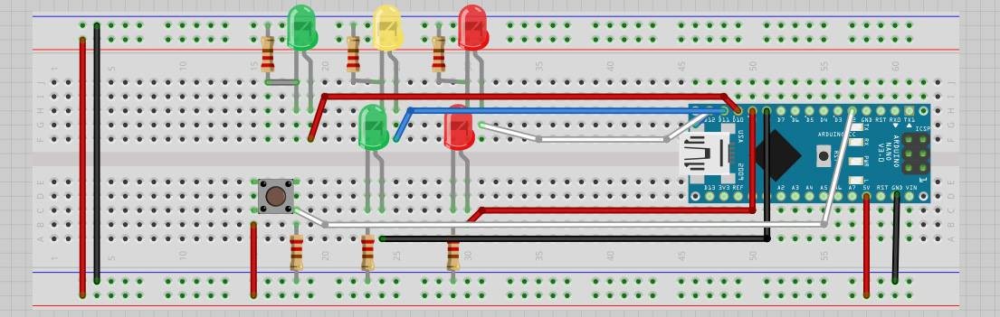
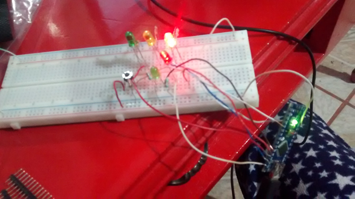
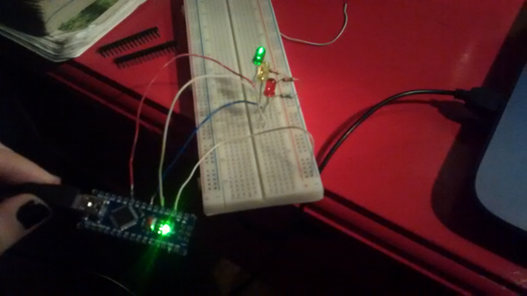
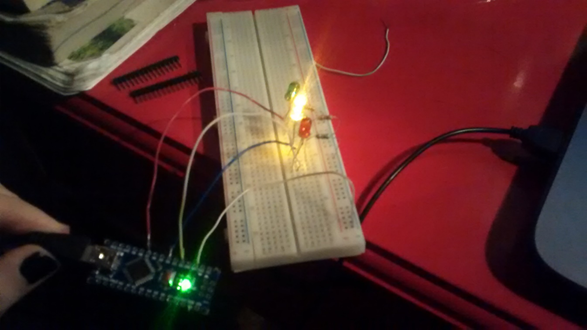

## Simulación de un Semaforo con LEDS
*** Objetivo ***

Con esta práctica realizaremos un ejemplo con el que encenderemos leds con Arduino montando nuestro propio semáforo basado en el funcionamiento del Reino Unido.

# Diagrama de configuración :
---------------------.p------------------------

### Materiales:
---------------------------------------------
- Arduino Nano 
- Protoboard
- Latiguillos
- 5 LED´s
- Resistencias de 220Ω

### Conexiones:
---------------------------------------------
Se conectan los LEDs rojo, amarillo y verde a los pines digitales 13, 12 y 11 de la placa de arduino (utilizando su debida resistencia). La patilla larga del LED debe ser conectada al voltaje positivo (ánodo) y la corta al voltaje negativo (cátodo) pasando por la resistencia.

### Programació IDE Arduino:
---------------------------------------------

<pre>
const int CAR_RED = 12; //red light of vehicular traffic initialized in 12
const int CAR_YELLOW = 11; //yellow light of vehicular traffic initialized in 11
const int CAR_GREEN = 10; //green light of vehicular traffic initialized in 10
const int PED_RED = 9; // red light of the pedestrian traffic initialized in 9
const int PED_GREEN = 8; // green light of the pedestrian traffic initialized in 8
const int BUTTON = 2; // button pin initialized in 2
int crossTime = 10000; //time alloyoud to cross
unsigned long changeTime; //time since BUTTON pressed
int state = LOW; //if is push button

/*
The method setup() configures the pin of the lights of the traffic lights to behave like an exit with the method pinMode()
Also the method digitalWrite() Write a HIGH or a LOW value to a digital pin.
*/
void setup() {
  pinMode(CAR_RED, OUTPUT);
  pinMode(CAR_YELLOW, OUTPUT);
  pinMode(CAR_GREEN, OUTPUT);
  pinMode(PED_RED, OUTPUT);
  pinMode(PED_GREEN, OUTPUT);
  pinMode(BUTTON, INPUT); // button on pin 2
  digitalWrite(CAR_GREEN, HIGH);
  digitalWrite(PED_RED, HIGH);
}

/*
The method loop()has two conditions, one that verifies if the button is pressed, if it is true the variable "state" takes the value of "high",
the second validation is responsible for verifying if the variable "satate" has the value of "high" and if the time that has passed since
the button was pressed in greater than 10 seconds
*/
void loop() {
  if (digitalRead(BUTTON)) //Change of state is button is pressed
    state = HIGH;
  if (state == HIGH && (millis() - changeTime) > crossTime) {
    changeLight();
    state = LOW;
  }
}

/*
The mothod changeLight is responsible for changing the lights of the traffic lights with the digitalWrite() method
*/
void changeLight() {
  digitalWrite(CAR_GREEN, LOW); //green off
  digitalWrite(CAR_YELLOW, HIGH); //yellow on
  delay(2000); //wait 2 seconds
  digitalWrite(CAR_YELLOW, LOW); //green off
  digitalWrite(CAR_RED, HIGH); //yellow on
  delay(2000); //wait 2 seconds
  digitalWrite(PED_RED, LOW); //green off
  digitalWrite(PED_GREEN, HIGH); //yellow on
  delay(crossTime); //wait for
  for (int i = 0; i < 10; i++) {
    digitalWrite(PED_RED, HIGH); //Turn on red pedestrian traffic light
    delay(250);//wait 250 milliseconds
    digitalWrite(PED_GREEN, LOW);//Turn off green pedestrian traffic light
    delay(250);//wait 250 milliseconds
  }
  digitalWrite(PED_RED, HIGH);//Turn on red pedestrian traffic light
  delay(500);//wait 500 milliseconds
  digitalWrite(CAR_YELLOW, HIGH);//turn on the yellow light of the traffic lights of the vehicles
  digitalWrite(CAR_RED, LOW);//turn on the red light of the traffic lights of the vehicles
  delay(1000);//wait 500 milliseconds
  digitalWrite(CAR_GREEN, HIGH);//turn on the green light of the traffic lights of the vehicles
  digitalWrite(CAR_YELLOW, LOW);//turn on the yellow light of the traffic lights of the vehicles

  //record the time size last change of lights
  changeTime = millis();
  //then return to the my program loop
}
</pre>

### Resultados:
---------------------------------------------

### Conclusión:
---------------------------------------------
En esta práctica pudimos implementar un semáforo vehicular y peatonal en base a la funcionalidad que se utiliza en el Reino Unido utilizando el ambiente de desarrollo de Arduino, el cual contiene instrucciones muy simples de utilizar y que nos permiten programar la funcionalidad en base a las necesidades que ocupemos. Al terminar de programar las instrucciones necesarias en el Arduino pudimos ensamblarlo en el Protoboard y probar que funciona el semáforo.

Proyecto realizado por:
-----------------------
Saucedo Guerrero Daniel de Jesús
14240859@itleon.edu.mx
Instituto Tecnológico de León

